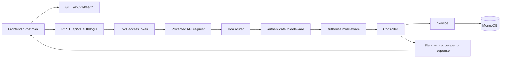
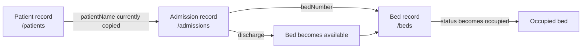
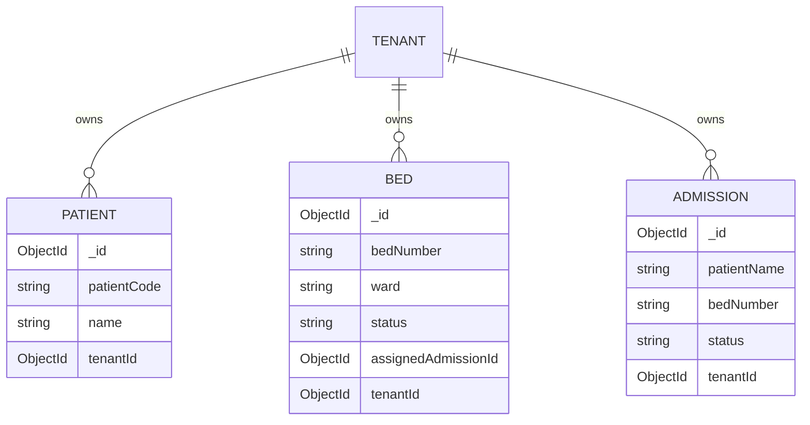
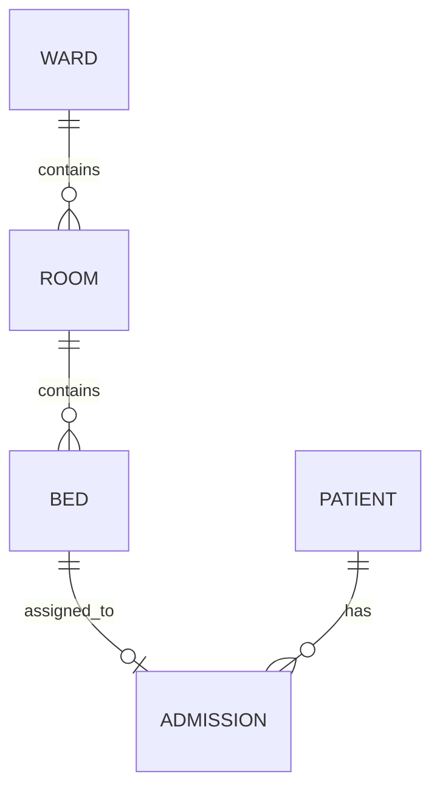

# HMS API Flow Guide

This document shows how the current API is connected. The base URL is:

```text
/api/v1
```

All protected endpoints require:

```http
Authorization: Bearer <accessToken>
```

## 1. Request Flow



## 2. Application Route Mounting

`app.ts` mounts every module below the `/api/v1` prefix.

```mermaid
flowchart TD
    App[app.ts] --> Prefix[/api/v1]
    Prefix --> Auth[/auth]
    Prefix --> Tenants[/tenants]
    Prefix --> Patients[/patients]
    Prefix --> Beds[/beds]
    Prefix --> Appointments[/appointments]
    Prefix --> Admissions[/admissions]
    Prefix --> Emergencies[/emergencies]
    Prefix --> Doctors[/doctors]
    Prefix --> Staff[/staff]
    Prefix --> Departments[/departments]
    Prefix --> Discharge[/discharge]
    Prefix --> Invoice[/invoices]
    Prefix --> Dashboard[/dashboard]
    Prefix --> Analytics[/analytics]
```

There is currently **no `/rooms` route** mounted in `app.ts`.

## 3. Patient, Admission, and Bed Flow

The current implementation connects a patient to a bed through an admission.



### Current database relationship



Important: `ADMISSION` currently stores `patientName`, not `patientId`. Therefore the database does not yet enforce a direct Patient-to-Admission relationship.

## 4. Working API Sequence

### Step 1: Login

```http
POST /api/v1/auth/login
```

Use the returned `data.accessToken` for the remaining requests.

### Step 2: Create a patient

```http
POST /api/v1/patients
Authorization: Bearer <accessToken>
Content-Type: application/json
```

```json
{
  "patientCode": "P-1001",
  "name": "John Doe",
  "gender": "male",
  "phone": "5551234567"
}
```

### Step 3: Create a bed

```http
POST /api/v1/beds
Authorization: Bearer <accessToken>
Content-Type: application/json
```

```json
{
  "bedNumber": "B-101",
  "ward": "General Ward",
  "type": "general",
  "status": "available"
}
```

### Step 4: Check available beds

```http
GET /api/v1/beds/available
Authorization: Bearer <accessToken>
```

### Step 5: Admit the patient to the bed

The current IPD endpoint requires the patient's name and bed number:

```http
POST /api/v1/admissions/ipd
Authorization: Bearer <accessToken>
Content-Type: application/json
```

```json
{
  "patientName": "John Doe",
  "admissionType": "IPD",
  "bedNumber": "B-101"
}
```

The bed should then have:

```json
{
  "status": "occupied",
  "assignedAdmissionId": "<admission-id>"
}
```

### Step 6: List admissions

```http
GET /api/v1/admissions
Authorization: Bearer <accessToken>
```

### Step 7: Discharge the patient

```http
PATCH /api/v1/admissions/<admission-id>/discharge
Authorization: Bearer <accessToken>
```

This changes the admission to `discharged` and releases the bed back to `available`.

## 5. Role Access for These APIs

| API | Allowed roles |
|---|---|
| `POST /patients` | admin, tenant, doctor, staff |
| `GET /patients` | admin, tenant, doctor, staff |
| `POST /beds` | admin, tenant, staff |
| `GET /beds` | admin, tenant, doctor, staff |
| `GET /beds/available` | admin, tenant, doctor, staff |
| `POST /admissions/ipd` | admin, tenant, doctor, staff |
| `GET /admissions` | admin, tenant, doctor, staff |
| `PATCH /admissions/:id/discharge` | admin, tenant, doctor, staff |

## 6. Room API Status

A Room API is not implemented yet. There is currently no:

- `src/modules/room/` module
- `Room` model
- `/api/v1/rooms` route
- `roomId` field on the Bed model

The planned relationship should be:



To implement this properly, the next model changes should add `patientId` to `Admission` and `roomId` to `Bed`, then create Room and Ward modules.
