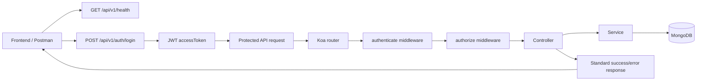
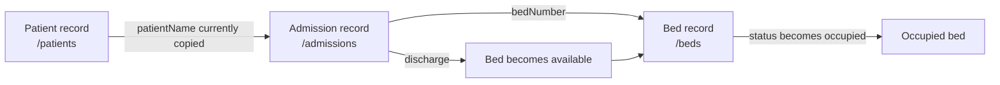
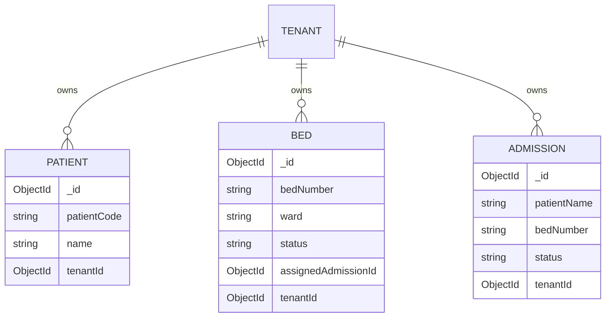
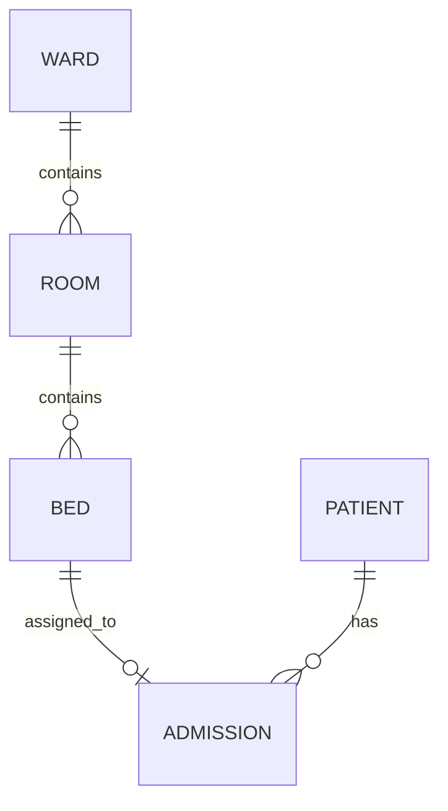
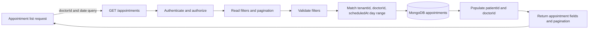

# HMS API Documentation

Base URL: `/api/v1`

> All endpoints under `/api/v1` require `Authorization: Bearer <accessToken>` unless otherwise noted.

## Authentication

### POST /auth/login
Login user and get JWT tokens.

**Request Body:**
```json
{
  "email": "user@example.com",
  "password": "password123"
}
```

**Response:**
```json
{
  "status": "success",
  "message": "Login successful",
  "data": {
    "user": {
      "id": "60d5ecb74b24c72b8c8b4567",
      "email": "user@example.com",
      "role": "tenant",
      "tenantId": "60d5ecb74b24c72b8c8b4568"
    },
    "accessToken": "eyJhbGciOiJIUzI1NiIsInR5cCI6IkpXVCJ9...",
    "refreshToken": "eyJhbGciOiJIUzI1NiIsInR5cCI6IkpXVCJ9..."
  }
}
```

### POST /auth/refresh
Refresh access token using a refresh token.

**Request Body:**
```json
{
  "refreshToken": "eyJhbGciOiJIUzI1NiIsInR5cCI6IkpXVCJ9..."
}
```

**Response:**
```json
{
  "status": "success",
  "message": "Token refreshed",
  "data": {
    "accessToken": "eyJhbGciOiJIUzI1NiIsInR5cCI6IkpXVCJ9...",
    "refreshToken": "eyJhbGciOiJIUzI1NiIsInR5cCI6IkpXVCJ9..."
  }
}
```

### POST /auth/register
Register a new user.

This endpoint is public and does not require an authentication token.

**Request Body:**
```json
{
  "name": "John Doe",
  "email": "john@example.com",
  "password": "password123",
  "role": "doctor",
  "tenantId": "60d5ecb74b24c72b8c8b4568"
}
```

**Response:**
```json
{
  "status": "success",
  "message": "User created",
  "data": {
    "id": "60d5ecb74b24c72b8c8b4567",
    "email": "john@example.com",
    "role": "doctor",
    "tenantId": "60d5ecb74b24c72b8c8b4568"
  }
}
```

### GET /auth/profile
Get current user profile.

**Response:**
```json
{
  "status": "success",
  "data": {
    "_id": "60d5ecb74b24c72b8c8b4567",
    "name": "John Doe",
    "email": "john@example.com",
    "role": "doctor",
    "tenantId": "60d5ecb74b24c72b8c8b4568",
    "createdAt": "2023-05-11T10:00:00.000Z"
  }
}
```

## Tenants

### GET /tenants
List all tenants.

**Authorization:**
- `admin` only via `ACCESS_GROUPS.PLATFORM_ADMINS`

**Response:**
```json
{
  "status": "success",
  "data": [
    {
      "_id": "60d5ecb74b24c72b8c8b4568",
      "name": "City Hospital",
      "state": "Maharashtra",
      "country": "India",
      "metadata": {},
      "createdAt": "2023-05-11T10:00:00.000Z"
    }
  ]
}
```

### POST /tenants
Create a new tenant.

**Authorization:**
- `admin` only via `ACCESS_GROUPS.PLATFORM_ADMINS`

**Request Body:**
```json
{
  "name": "City Hospital",
  "state": "Maharashtra",
  "country": "India",
  "metadata": {
    "address": "123 Main St",
    "phone": "+91-1234567890"
  }
}
```

**Response:**
```json
{
  "status": "success",
  "message": "Tenant created",
  "data": {
    "_id": "60d5ecb74b24c72b8c8b4568",
    "name": "City Hospital",
    "state": "Maharashtra",
    "country": "India",
    "metadata": {
      "address": "123 Main St",
      "phone": "+91-1234567890"
    },
    "createdAt": "2023-05-11T10:00:00.000Z"
  }
}
```

### GET /tenants/:id
Get tenant details.

**Authorization:**
- `admin` or tenant owner via `ACCESS_GROUPS.TENANT_ADMINS`

**Response:**
```json
{
  "status": "success",
  "data": {
    "_id": "60d5ecb74b24c72b8c8b4568",
    "name": "City Hospital",
    "state": "Maharashtra",
    "country": "India",
    "metadata": {
      "address": "123 Main St",
      "phone": "+91-1234567890"
    },
    "createdAt": "2023-05-11T10:00:00.000Z"
  }
}
```

## Doctors

### GET /doctors
List doctors for a tenant.

**Authorization:**
- `admin` or `tenant` via `ACCESS_GROUPS.TENANT_ADMINS`

**Query Parameters:**
- `tenantId` required when the caller is an admin.

**Response:**
```json
{
  "status": "success",
  "data": [
    {
      "_id": "60d5ecb74b24c72b8c8b4569",
      "name": "Dr. Smith",
      "specialization": "Cardiology",
      "profileImage": "https://storage.example.com/doctors/doctor-1.jpg",
      "phone": "+91-9876543210",
      "email": "smith@hospital.com",
      "userId": "60d5ecb74b24c72b8c8b4567",
      "tenantId": "60d5ecb74b24c72b8c8b4568",
      "createdAt": "2023-05-11T10:00:00.000Z"
    }
  ]
}
```

### POST /doctors
Create a doctor profile.

**Authorization:**
- `admin` or `tenant` via `ACCESS_GROUPS.TENANT_ADMINS`

**Request Body:**
```json
{
  "name": "Dr. Smith",
  "specialization": "Cardiology",
  "profileImage": "https://storage.example.com/doctors/doctor-1.jpg",
  "phone": "+91-9876543210",
  "email": "smith@hospital.com",
  "userId": "60d5ecb74b24c72b8c8b4567",
  "tenantId": "60d5ecb74b24c72b8c8b4568"
}
```

**Notes:**
- `userId` is optional and links the profile to an auth user.
- `profileImage` is required and should contain the stored image URL/reference.
- Admin users must pass `tenantId`; tenant users are scoped automatically.

**Response:**
```json
{
  "status": "success",
  "message": "Doctor created",
  "data": {
    "_id": "60d5ecb74b24c72b8c8b4569",
    "name": "Dr. Smith",
    "specialization": "Cardiology",
    "profileImage": "https://storage.example.com/doctors/doctor-1.jpg",
    "phone": "+91-9876543210",
    "email": "smith@hospital.com",
    "userId": "60d5ecb74b24c72b8c8b4567",
    "tenantId": "60d5ecb74b24c72b8c8b4568",
    "createdAt": "2023-05-11T10:00:00.000Z"
  }
}
```

### GET /doctors/:id
Get a single doctor profile for the current tenant.

**Authorization:**
- `admin` or `tenant` via `ACCESS_GROUPS.TENANT_ADMINS`

**Response:**
```json
{
  "status": "success",
  "message": "Doctor retrieved",
  "data": {
    "_id": "60d5ecb74b24c72b8c8b4569",
    "name": "Dr. Smith",
    "specialization": "Cardiology",
    "profileImage": "https://storage.example.com/doctors/doctor-1.jpg",
    "phone": "+91-9876543210",
    "email": "smith@hospital.com",
    "userId": "60d5ecb74b24c72b8c8b4567",
    "tenantId": "60d5ecb74b24c72b8c8b4568",
    "createdAt": "2023-05-11T10:00:00.000Z"
  }
}
```

### PATCH /doctors/:id
Update a doctor profile.

**Authorization:**
- `admin` or `tenant` via `ACCESS_GROUPS.TENANT_ADMINS`

**Request Body:**
```json
{
  "name": "Dr. Smith Updated",
  "specialization": "Neurology",
  "profileImage": "https://storage.example.com/doctors/doctor-1-updated.jpg",
  "phone": "+91-9988776655",
  "email": "smith.updated@hospital.com"
}
```

**Notes:**
- `tenantId` cannot be changed from this endpoint.
- `userId` can be reassigned only if the target user belongs to the same tenant and has the `doctor` role.

**Response:**
```json
{
  "status": "success",
  "message": "Doctor updated",
  "data": {
    "_id": "60d5ecb74b24c72b8c8b4569",
    "name": "Dr. Smith Updated",
    "specialization": "Neurology",
    "profileImage": "https://storage.example.com/doctors/doctor-1-updated.jpg",
    "phone": "+91-9988776655",
    "email": "smith.updated@hospital.com",
    "userId": "60d5ecb74b24c72b8c8b4567",
    "tenantId": "60d5ecb74b24c72b8c8b4568",
    "createdAt": "2023-05-11T10:00:00.000Z"
  }
}
```

### DELETE /doctors/:id
Delete a doctor profile from the current tenant.

**Authorization:**
- `admin` or `tenant` via `ACCESS_GROUPS.TENANT_ADMINS`

**Response:**
```json
{
  "status": "success",
  "message": "Doctor deleted",
  "data": {
    "_id": "60d5ecb74b24c72b8c8b4569",
    "name": "Dr. Smith Updated",
    "specialization": "Neurology",
    "phone": "+91-9988776655",
    "email": "smith.updated@hospital.com",
    "userId": "60d5ecb74b24c72b8c8b4567",
    "tenantId": "60d5ecb74b24c72b8c8b4568",
    "createdAt": "2023-05-11T10:00:00.000Z"
  }
}
```

## Departments

### GET /departments
List departments for the current tenant.

**Authorization:**
- `admin`, `tenant`, `doctor`, or `staff` via `ACCESS_GROUPS.CLINICAL_OPERATIONS`

**Response:**
```json
{
  "status": "success",
  "message": "Departments retrieved",
  "data": [
    {
      "_id": "60d5ecb74b24c72b8c8b4575",
      "name": "Cardiology",
      "description": "Heart and vascular care",
      "tenantId": "60d5ecb74b24c72b8c8b4568",
      "createdAt": "2023-05-11T10:00:00.000Z"
    },
    {
      "_id": "60d5ecb74b24c72b8c8b4576",
      "name": "Neurology",
      "description": "Neurological and brain care",
      "tenantId": "60d5ecb74b24c72b8c8b4568",
      "createdAt": "2023-05-11T10:00:00.000Z"
    }
  ]
}
```

## Analytics / BI

### GET /analytics
Get the primary BI dashboard overview for the current tenant and user role.

**Authorization:**
- Any authenticated user with dashboard access via `authorize()`.

**Query Parameters:**
- `period` (optional): `today`, `weekly`, `monthly`, `quarterly`, `yearly`, `custom`
- `department` (optional): department filter
- `doctor` (optional): doctor filter
- `status` (optional): appointment status filter

**Response:**
```json
{
  "success": true,
  "data": {
    "title": "Business Intelligence Overview",
    "period": "weekly",
    "filters": [
      {
        "key": "period",
        "label": "Period",
        "value": "weekly",
        "options": ["Weekly", "Monthly", "Quarterly", "Yearly", "Custom"]
      },
      {
        "key": "department",
        "label": "Department",
        "value": "All",
        "options": ["All", "Cardiology", "Radiology", "Dental Surgery", "Orthopaedics", "General Medicine"]
      }
    ],
    "kpis": [
      {
        "label": "Total Patients",
        "value": "638",
        "delta": "+12.4%",
        "type": "primary"
      },
      {
        "label": "Appointments",
        "value": "2,184",
        "delta": "+8.7%",
        "type": "info"
      }
    ],
    "popularDoctors": [
      {
        "initials": "AM",
        "name": "Dr. Alex Morgan",
        "specialty": "Cardiologist",
        "bookings": 258
      }
    ],
    "topDepartments": [
      { "name": "Cardiology", "count": 214, "color": "#1f7ae0" },
      { "name": "Neurology", "count": 150, "color": "#24c789" }
    ],
    "doctorsSchedule": [
      {
        "initials": "SJ",
        "name": "Dr. Sarah Johnson",
        "specialty": "Orthopedic Surgeon",
        "available": 48,
        "unavailable": 28,
        "leave": 12
      }
    ],
    "incomeByTreatment": [
      {
        "treatment": "Cardiology",
        "appointments": 4,
        "value": 5985
      }
    ],
    "appointmentsTable": [
      {
        "doctor": "Dr. Sarah Johnson",
        "patient": "Alice Turner",
        "date": "2026-09-17",
        "time": "09:00 AM",
        "mode": "In Person",
        "status": "Confirmed"
      }
    ],
    "reports": [
      { "key": "dashboard-overview", "label": "Dashboard Overview", "type": "summary" },
      { "key": "doctor-performance", "label": "Doctor Performance", "type": "trend" }
    ],
    "tabs": ["Overview", "Doctors", "Departments", "Revenue", "Appointments"]
  }
}
```

### GET /analytics/overview
Alias endpoint for the BI overview data.

**Authorization:**
- Any authenticated user with dashboard access via `authorize()`.

**Response:**
Same structure as `GET /analytics`.

## Patients

### GET /patients
List patients for the current tenant.

**Authorization:**
- `admin`, `tenant`, `doctor`, or `staff` via `ACCESS_GROUPS.CLINICAL_OPERATIONS`

**Response:**
```json
{
  "status": "success",
  "data": [
    {
      "_id": "60d5ecb74b24c72b8c8b4570",
      "patientCode": "PAT-1001",
      "name": "Jane Doe",
      "profileImage": "https://storage.example.com/patients/patient-1.jpg",
      "dateOfBirth": "1990-07-20T00:00:00.000Z",
      "gender": "female",
      "phone": "+91-9876501234",
      "email": "jane.doe@example.com",
      "address": "45 Ocean Drive",
      "emergencyContact": "+91-9876509999",
      "medicalHistory": "No known allergies",
      "tenantId": "60d5ecb74b24c72b8c8b4568",
      "createdAt": "2023-05-11T10:00:00.000Z"
    }
  ]
}
```

### POST /patients
Create a patient.

**Authorization:**
- `admin`, `tenant`, `doctor`, or `staff` via `ACCESS_GROUPS.CLINICAL_OPERATIONS`

**Request Body:**
```json
{
  "patientCode": "PAT-1001",
  "name": "Jane Doe",
  "profileImage": "https://storage.example.com/patients/patient-1.jpg",
  "dateOfBirth": "1990-07-20",
  "gender": "female",
  "phone": "+91-9876501234",
  "email": "jane.doe@example.com",
  "address": "45 Ocean Drive",
  "emergencyContact": "+91-9876509999",
  "medicalHistory": "No known allergies"
}
```

`profileImage` is optional on patient create and update and should contain the stored image URL/reference when provided.

**Response:**
```json
{
  "status": "success",
  "message": "Patient created",
  "data": {
    "_id": "60d5ecb74b24c72b8c8b4570",
    "patientCode": "PAT-1001",
    "name": "Jane Doe",
    "profileImage": "https://storage.example.com/patients/patient-1.jpg",
    "dateOfBirth": "1990-07-20T00:00:00.000Z",
    "gender": "female",
    "phone": "+91-9876501234",
    "email": "jane.doe@example.com",
    "address": "45 Ocean Drive",
    "emergencyContact": "+91-9876509999",
    "medicalHistory": "No known allergies",
    "tenantId": "60d5ecb74b24c72b8c8b4568",
    "createdAt": "2023-05-11T10:00:00.000Z"
  }
}
```

### GET /patients/:id
Get patient details.

**Authorization:**
- `admin`, `tenant`, `doctor`, or `staff` via `ACCESS_GROUPS.CLINICAL_OPERATIONS`

**Response:**
```json
{
  "status": "success",
  "data": {
    "_id": "60d5ecb74b24c72b8c8b4570",
    "patientCode": "PAT-1001",
    "name": "Jane Doe",
    "profileImage": "https://storage.example.com/patients/patient-1.jpg",
    "dateOfBirth": "1990-07-20T00:00:00.000Z",
    "gender": "female",
    "phone": "+91-9876501234",
    "email": "jane.doe@example.com",
    "address": "45 Ocean Drive",
    "emergencyContact": "+91-9876509999",
    "medicalHistory": "No known allergies",
    "tenantId": "60d5ecb74b24c72b8c8b4568",
    "createdAt": "2023-05-11T10:00:00.000Z"
  }
}
```

### PATCH /patients/:id
Update patient fields in the authenticated user's tenant. `profileImage` is optional and is returned in the updated patient response.

**Request Body:**
```json
{
  "profileImage": "https://storage.example.com/patients/patient-1-updated.jpg"
}
```

**Response:**
```json
{
  "status": "success",
  "message": "Patient updated",
  "data": {
    "_id": "60d5ecb74b24c72b8c8b4570",
    "patientCode": "PAT-1001",
    "name": "Jane Doe",
    "profileImage": "https://storage.example.com/patients/patient-1-updated.jpg",
    "tenantId": "60d5ecb74b24c72b8c8b4568"
  }
}
```

### GET /patients/search?q=Deepanshu
Search patients by name, patient code, phone, email, or identity document number. Tenant users are scoped to their own tenant; admins must provide `tenantId` to scope the search.

**Query Parameters:**
- `q` required: search text.
- `tenantId` required for admin callers.

**Response:**
```json
{
  "status": "success",
  "message": "Patients searched",
  "data": [
    {
      "_id": "60d5ecb74b24c72b8c8b4570",
      "patientCode": "PAT-1001",
      "name": "Deepanshu Kumar",
      "profileImage": "https://storage.example.com/patients/patient-1.jpg",
      "tenantId": "60d5ecb74b24c72b8c8b4568"
    }
  ]
}
```

## Patient History and Clinical Workflow

The current backend includes a patient summary and visit history layer built around the patient, visit, consultation, prescription, lab order, and procedure models.

### GET /patients/:patientId/summary
Return the patient dashboard summary for a specific patient, including the most recent visit and paginated prior visits.

**Authorization:**
- `admin`, `tenant`, `doctor`, or `staff` with `ACCESS_GROUPS.CLINICAL_OPERATIONS`

**Response:**
```json
{
  "status": "success",
  "message": "Patient summary retrieved",
  "data": {
    "patient": {
      "_id": "60d5ecb74b24c72b8c8b4570",
      "patientCode": "PAT-1001",
      "name": "Jane Doe",
      "phone": "+91-9876501234",
      "tenantId": "60d5ecb74b24c72b8c8b4568"
    },
    "currentMedications": [
      {
        "prescriptionId": "60d5ecb74b24c72b8c8b4590",
        "prescribedAt": "2026-09-18T10:30:00.000Z",
        "doctorId": "60d5ecb74b24c72b8c8b4569",
        "items": [
          {
            "medicineName": "Amoxicillin",
            "dosage": "500mg",
            "frequency": "BD",
            "status": "active"
          }
        ]
      }
    ],
    "latestVisit": {
      "_id": "60d5ecb74b24c72b8c8b4591",
      "visitCode": "VIS-20260918-001",
      "status": "in_consultation"
    },
    "visits": [
      {
        "visit": { "_id": "60d5ecb74b24c72b8c8b4591" },
        "consultation": { "clinicalNotes": "Follow-up advised" },
        "prescriptions": [],
        "reports": [],
        "procedures": [],
        "invoices": [],
        "payments": [],
        "notes": ["Follow-up advised"]
      }
    ],
    "appointments": [],
    "admissions": [],
    "discharges": [],
    "invoices": [],
    "payments": [],
    "pagination": {
      "page": 1,
      "limit": 20,
      "total": 1,
      "pages": 1
    }
  }
}
```

### GET /visits/:visitId/history
Return all structured clinical and billing data associated with a single visit.

**Authorization:**
- `admin`, `tenant`, `doctor`, or `staff` with `ACCESS_GROUPS.CLINICAL_OPERATIONS`

**Response:**
```json
{
  "status": "success",
  "message": "Visit history retrieved",
  "data": {
    "visit": {
      "_id": "60d5ecb74b24c72b8c8b4591",
      "visitCode": "VIS-20260918-001",
      "patientId": "60d5ecb74b24c72b8c8b4570",
      "doctorId": "60d5ecb74b24c72b8c8b4569",
      "status": "completed"
    },
    "consultation": {
      "chiefComplaint": "Fever",
      "diagnosis": "Viral fever",
      "clinicalNotes": "Patient improving"
    },
    "prescriptions": [
      {
        "_id": "60d5ecb74b24c72b8c8b4592",
        "items": [
          {
            "medicineName": "Paracetamol",
            "dosage": "650mg",
            "status": "active"
          }
        ]
      }
    ],
    "reports": [],
    "labOrders": [],
    "procedures": [],
    "invoices": [],
    "payments": [],
    "notes": ["Patient improving"]
  }
}
```

### Visit and clinical endpoints

| Method | Path | Purpose |
| --- | --- | --- |
| POST | `/patients/:patientId/visits` | Create a visit for the patient |
| GET | `/patients/:patientId/visits` | List visits for a patient |
| GET | `/visits/:visitId` | Get a visit by ID |
| PATCH | `/visits/:visitId/status` | Update visit lifecycle status |
| POST | `/visits/:visitId/consultation` | Save or upsert consultation for a visit |
| GET | `/visits/:visitId/consultation` | Fetch consultation data |
| PATCH | `/consultations/:consultationId` | Update consultation |
| POST | `/visits/:visitId/prescriptions` | Create prescription |
| GET | `/patients/:patientId/prescriptions` | List prescriptions for a patient |
| GET | `/patients/:patientId/medications/current` | List active current medications |
| GET | `/visits/:visitId/prescriptions` | List prescriptions for one visit |
| PATCH | `/prescriptions/:prescriptionId` | Update prescription |
| POST | `/visits/:visitId/lab-orders` | Create a lab order |
| GET | `/patients/:patientId/lab-orders` | List lab orders for a patient |
| POST | `/lab-orders/:labOrderId/report` | Create a lab result/report |
| GET | `/visits/:visitId/reports` | List reports for a visit |
| POST | `/visits/:visitId/procedures` | Create a procedure record |
| GET | `/visits/:visitId/procedures` | List procedures for a visit |
| GET | `/patients/:patientId/procedures` | List procedures for a patient |

> These routes are protected under the clinical operations access group and are tenant-scoped using the authenticated user tenant.

## Storage

New uploads are stored in a private AWS S3 bucket under a tenant-specific object key. The API streams downloads through authenticated routes.

Configure `AWS_REGION` to match the bucket's region and set `AWS_S3_BUCKET` (or `S3_BUCKET_NAME`). The bucket must already exist in the AWS account selected by the configured credentials, and the credentials need permission to put, get, and delete objects. A `NoSuchBucket` upload response means to verify the bucket name, region, and AWS account; the application does not create buckets. `S3_PREFIX` optionally adds a key prefix before the tenant folder, and `S3_SERVER_SIDE_ENCRYPTION` configures object encryption (defaults to `AES256`). Set `API_BASE_URL` (or `PUBLIC_API_URL` / `SERVER_URL`) to your live API origin when upload responses should return absolute URLs, for example `http://65.0.199.154:4000`. For S3-compatible providers, set `AWS_S3_ENDPOINT` (or `S3_ENDPOINT_URL`) to the endpoint supplied by the provider; set `AWS_S3_FORCE_PATH_STYLE=true` (or `S3_USE_PATH_STYLE=true`) only if that provider requires path-style bucket addressing. AWS credentials use the AWS SDK default credential provider chain; use an IAM role in deployed environments and do not commit access keys.

### POST /storage/upload
Upload a file using `multipart/form-data`. The maximum file size is 25 MB.

**Authorization:**
- Any authenticated user

**Form Data:**
- `file`: binary file
- `folder` (optional): `images`, `videos`, or `files`
- `tenantId` (required only for platform admin users)

**Allowed file types:**
- `images`: JPG, PNG, GIF, WEBP, BMP, SVG
- `videos`: MP4, WEBM, MOV, AVI, MPEG
- `files`: PDF, DOC, DOCX, XLS, XLSX, CSV, TXT, ZIP, JSON

**Example:**
```bash
curl -X POST "https://api.example.com/api/v1/storage/upload" -H "Authorization: Bearer <accessToken>" -F "file=@clinic-logo.png" -F "folder=images"
```

Use the returned `data.url` as the value for fields such as staff `profileImage` and tenant `settings.profile.logoUrl`.

**Response:**
```json
{
  "status": "success",
  "message": "File uploaded",
  "data": {
    "_id": "60d5ecb74b24c72b8c8b4588",
    "tenantId": "60d5ecb74b24c72b8c8b4568",
    "userId": "60d5ecb74b24c72b8c8b4567",
    "folder": "images",
    "originalName": "patient-photo.png",
    "storedName": "550e8400-e29b-41d4-a716-446655440000-patient-photo.png",
    "objectKey": "60d5ecb74b24c72b8c8b4568/images/550e8400-e29b-41d4-a716-446655440000-patient-photo.png",
    "storageProvider": "s3",
    "mimeType": "image/png",
    "size": 125432,
    "url": "/api/v1/storage/files/images/550e8400-e29b-41d4-a716-446655440000-patient-photo.png",
    "status": "active",
    "createdAt": "2026-09-22T12:00:00.000Z"
  }
}
```

`data.url` is always an authenticated API proxy URL. A public S3 or CloudFront URL is not required.

### GET /storage/files/:folder/:filename
Download a file from S3. The route is tenant-scoped to the authenticated user. Existing local-storage records are also served when their files still exist.

**Example:**
```http
GET /api/v1/storage/files/images/550e8400-e29b-41d4-a716-446655440000-patient-photo.png
Authorization: Bearer <accessToken>
```

Platform admin users must include `tenantId` as a query parameter when downloading, for example `/api/v1/storage/files/images/file.png?tenantId=<tenantId>`.

### DELETE /storage/files/:folder/:filename
Delete a file from S3 and remove its metadata record. The operation is scoped to the authenticated user's tenant.

**Authorization:**
- Any authenticated user
- Platform admin users must include `tenantId` in the query string.

**Example:**
```http
DELETE /api/v1/storage/files/images/550e8400-e29b-41d4-a716-446655440000-patient-photo.png
```

**Response:**
```json
{
  "status": "success",
  "message": "File deleted",
  "data": {
    "deleted": true,
    "tenantId": "60d5ecb74b24c72b8c8b4568",
    "folder": "images",
    "filename": "550e8400-e29b-41d4-a716-446655440000-patient-photo.png"
  }
}
```

## Admissions

### POST /admissions/from-opd
Convert an OPD appointment into an admission.

**Authorization:**
- `admin`, `tenant`, `doctor`, or `staff` via `ACCESS_GROUPS.CLINICAL_OPERATIONS`

**Request Body:**
```json
{
  "appointmentId": "60d5ecb74b24c72b8c8b4571",
  "bedNumber": "B-101",
  "doctorId": "60d5ecb74b24c72b8c8b4569"
}
```

**Response:**
```json
{
  "status": "success",
  "message": "OPD converted to admission",
  "data": {
    "_id": "60d5ecb74b24c72b8c8b4572",
    "patientName": "Jane Doe",
    "admissionType": "OPD",
    "appointmentId": "60d5ecb74b24c72b8c8b4571",
    "bedNumber": "B-101",
    "doctorId": "60d5ecb74b24c72b8c8b4569",
    "tenantId": "60d5ecb74b24c72b8c8b4568",
    "status": "admitted",
    "admittedAt": "2023-05-11T10:00:00.000Z"
  }
}
```

### POST /admissions/ipd
Create a new IPD admission.

**Authorization:**
- `admin`, `tenant`, `doctor`, or `staff` via `ACCESS_GROUPS.CLINICAL_OPERATIONS`

**Request Body:**
```json
{
  "patientName": "Jane Doe",
  "admissionType": "IPD",
  "bedNumber": "B-102",
  "doctorId": "60d5ecb74b24c72b8c8b4569"
}
```

**Response:**
```json
{
  "status": "success",
  "message": "IPD admission created",
  "data": {
    "_id": "60d5ecb74b24c72b8c8b4573",
    "patientName": "Jane Doe",
    "admissionType": "IPD",
    "bedNumber": "B-102",
    "doctorId": "60d5ecb74b24c72b8c8b4569",
    "tenantId": "60d5ecb74b24c72b8c8b4568",
    "status": "admitted",
    "admittedAt": "2023-05-11T10:00:00.000Z"
  }
}
```

### GET /admissions
List admissions for the current tenant.

**Authorization:**
- `admin`, `tenant`, `doctor`, or `staff` via `ACCESS_GROUPS.CLINICAL_OPERATIONS`

**Response:**
```json
{
  "status": "success",
  "data": [
    {
      "_id": "60d5ecb74b24c72b8c8b4572",
      "patientName": "Jane Doe",
      "admissionType": "OPD",
      "bedNumber": "B-101",
      "doctorId": "60d5ecb74b24c72b8c8b4569",
      "tenantId": "60d5ecb74b24c72b8c8b4568",
      "status": "admitted",
      "admittedAt": "2023-05-11T10:00:00.000Z"
    }
  ]
}
```

### PATCH /admissions/:id
Update editable fields on an admitted record.

**Authorization:**
- `admin`, `tenant`, `doctor`, or `staff` via `ACCESS_GROUPS.CLINICAL_OPERATIONS`

**Allowed Request Body Fields:**
- `doctorId`: MongoDB ObjectId string or `null`
- `bedNumber`: bed number string; when changed, the old bed is released and the new bed must be available
- `admissionType`: one of `IPD`, `OPD`, or `Emergency`

`status`, `patientName`, `tenantId`, and admission timestamps are not editable through this endpoint. Use `PATCH /admissions/:id/discharge` to discharge an admission.

**Request Body:**
```json
{
  "doctorId": "60d5ecb74b24c72b8c8b4569",
  "bedNumber": "B-103",
  "admissionType": "IPD"
}
```

**Response:**
```json
{
  "status": "success",
  "message": "Admission updated",
  "data": {
    "_id": "60d5ecb74b24c72b8c8b4572",
    "patientName": "Jane Doe",
    "admissionType": "IPD",
    "bedNumber": "B-103",
    "doctorId": {
      "_id": "60d5ecb74b24c72b8c8b4569",
      "name": "Dr. Smith",
      "specialization": "Cardiology"
    },
    "tenantId": "60d5ecb74b24c72b8c8b4568",
    "status": "admitted",
    "admittedAt": "2023-05-11T10:00:00.000Z"
  }
}
```

### PATCH /admissions/:id/discharge
Discharge an admission.

**Authorization:**
- `admin`, `tenant`, `doctor`, or `staff` via `ACCESS_GROUPS.CLINICAL_OPERATIONS`

**Response:**
```json
{
  "status": "success",
  "message": "Patient discharged",
  "data": {
    "_id": "60d5ecb74b24c72b8c8b4572",
    "patientName": "Jane Doe",
    "admissionType": "OPD",
    "bedNumber": "B-101",
    "doctorId": "60d5ecb74b24c72b8c8b4569",
    "tenantId": "60d5ecb74b24c72b8c8b4568",
    "status": "discharged",
    "dischargedAt": "2023-05-11T12:00:00.000Z"
  }
}
```

## Beds

### GET /beds
List all beds.

**Authorization:**
- `admin`, `tenant`, `doctor`, or `staff` via `ACCESS_GROUPS.CLINICAL_OPERATIONS`

**Response:**
```json
{
  "status": "success",
  "data": [
    {
      "_id": "60d5ecb74b24c72b8c8b4574",
      "bedNumber": "B-101",
      "status": "available",
      "assignedAdmissionId": null,
      "tenantId": "60d5ecb74b24c72b8c8b4568",
      "createdAt": "2023-05-11T10:00:00.000Z"
    }
  ]
}
```

### POST /beds
Create a bed.

**Authorization:**
- `admin`, `tenant`, or `staff` via `ACCESS_GROUPS.OPERATIONS_MANAGERS`

**Request Body:**
```json
{
  "bedNumber": "B-103"
}
```

**Response:**
```json
{
  "status": "success",
  "message": "Bed created",
  "data": {
    "_id": "60d5ecb74b24c72b8c8b4574",
    "bedNumber": "B-103",
    "status": "available",
    "tenantId": "60d5ecb74b24c72b8c8b4568",
    "createdAt": "2023-05-11T10:00:00.000Z"
  }
}
```

### GET /beds/available
List available beds.

**Authorization:**
- `admin`, `tenant`, `doctor`, or `staff` via `ACCESS_GROUPS.CLINICAL_OPERATIONS`

**Response:**
```json
{
  "status": "success",
  "data": [
    {
      "_id": "60d5ecb74b24c72b8c8b4574",
      "bedNumber": "B-103",
      "status": "available",
      "tenantId": "60d5ecb74b24c72b8c8b4568",
      "createdAt": "2023-05-11T10:00:00.000Z"
    }
  ]
}
```

## Appointments

### GET /appointments
List appointments for the current tenant.

**Authorization:**
- `admin`, `tenant`, or `staff` via `ACCESS_GROUPS.APPOINTMENT_MANAGERS`

**Query Parameters:**
- `doctorId` (optional): filter by doctor ID.
- `date` (optional): filter by appointment date in `YYYY-MM-DD` format. The date is interpreted as a UTC calendar day.
- `page` and `limit` (optional): pagination parameters.

When both `doctorId` and `date` are provided, both filters must match. Invalid doctor IDs, malformed dates, and invalid calendar dates return `400`.

**Response:**
```json
{
  "status": "success",
  "data": [
    {
      "_id": "60d5ecb74b24c72b8c8b4575",
      "patientId": {
        "_id": "60d5ecb74b24c72b8c8b4570",
        "name": "Jane Doe",
        "email": "jane@example.com",
        "phone": "+91-9876543210"
      },
      "patientName": "Jane Doe",
      "patientType": "local",
      "appointmentType": "OPD",
      "visitReason": "Routine checkup",
      "doctorId": {
        "_id": "60d5ecb74b24c72b8c8b4569",
        "name": "Dr. Smith",
        "specialization": "Cardiology"
      },
      "scheduledAt": "2026-09-28T09:30:00.000Z",
      "status": "scheduled",
      "tenantId": "60d5ecb74b24c72b8c8b4568",
      "createdBy": "60d5ecb74b24c72b8c8b4567",
      "createdAt": "2023-05-11T10:00:00.000Z"
    }
  ]
}
```

### POST /appointments
Create an appointment.

**Authorization:**
- `tenant` or `staff` via `ACCESS_GROUPS.APPOINTMENT_MANAGERS`

**Request Body:**
```json
{
  "patientId": "60d5ecb74b24c72b8c8b4570",
  "patientName": "Jane Doe",
  "patientType": "local",
  "appointmentType": "OPD",
  "visitReason": "Routine checkup",
  "doctorId": "60d5ecb74b24c72b8c8b4569",
  "scheduledAt": "2026-09-28T09:30:00.000Z"
}
```

**Response:**
```json
{
  "status": "success",
  "message": "Appointment created",
  "data": {
    "_id": "60d5ecb74b24c72b8c8b4575",
    "patientId": "60d5ecb74b24c72b8c8b4570",
    "patientName": "Jane Doe",
    "patientType": "local",
    "appointmentType": "OPD",
    "visitReason": "Routine checkup",
    "doctorId": "60d5ecb74b24c72b8c8b4569",
    "scheduledAt": "2026-09-28T09:30:00.000Z",
    "status": "scheduled",
    "tenantId": "60d5ecb74b24c72b8c8b4568",
    "createdBy": "60d5ecb74b24c72b8c8b4567",
    "createdAt": "2023-05-11T10:00:00.000Z"
  }
}
```

`scheduledAt` is an optional ISO-8601 datetime. When supplied, it is stored as a date and returned by create, list, detail, and update endpoints. The frontend should send the selected local appointment date/time as an ISO datetime with the intended timezone offset.

### GET /appointments/:id
Return one appointment for the authenticated user's tenant. The response uses the standard success envelope and includes populated patient and doctor references.

**Response:**
```json
{
  "status": "success",
  "message": "Appointment retrieved",
  "data": {
    "_id": "60d5ecb74b24c72b8c8b4575",
    "patientId": { "_id": "60d5ecb74b24c72b8c8b4570", "name": "Jane Doe" },
    "doctorId": { "_id": "60d5ecb74b24c72b8c8b4569", "name": "Dr. Smith" },
    "scheduledAt": "2026-09-28T09:30:00.000Z",
    "status": "scheduled",
    "tenantId": "60d5ecb74b24c72b8c8b4568"
  }
}
```

### PATCH /appointments/:id
Update an existing appointment in the authenticated user's tenant. Editable fields are `patientId`, `patientName`, `patientType`, `appointmentType`, `visitReason`, `doctorId`, and `scheduledAt`. Tenant, status, `visitId`, and creation metadata cannot be changed through this endpoint.

**Request Body:**
```json
{
  "doctorId": "60d5ecb74b24c72b8c8b4569",
  "visitReason": "Follow-up consultation",
  "scheduledAt": "2026-09-29T10:00:00.000Z"
}
```

**Response:**
```json
{
  "status": "success",
  "message": "Appointment updated",
  "data": {
    "_id": "60d5ecb74b24c72b8c8b4575",
    "patientName": "Jane Doe",
    "appointmentType": "OPD",
    "visitReason": "Follow-up consultation",
    "scheduledAt": "2026-09-29T10:00:00.000Z",
    "status": "scheduled",
    "tenantId": "60d5ecb74b24c72b8c8b4568"
  }
}
```

### DELETE /appointments/:id
Delete an appointment belonging to the authenticated user's tenant. A missing or other-tenant appointment returns 404.

**Response:**
```json
{
  "status": "success",
  "message": "Appointment deleted",
  "data": {
    "_id": "60d5ecb74b24c72b8c8b4575",
    "patientName": "Jane Doe",
    "status": "scheduled",
    "tenantId": "60d5ecb74b24c72b8c8b4568"
  }
}
```

### POST /appointments/:id/check-in
Check in an appointment. This creates a visit, sets appointment status to `checked_in`, and links the visit through `visitId`. The response `data` is the created visit.

Appointment API status values are `scheduled`, `checked_in`, `completed`, and `cancelled`. Frontend labels should map `Schedule` to `scheduled`, `Checked In` to `checked_in`, `Checked Out` to `completed`, and `Cancelled` to `cancelled`. There is no separate `confirmed` API status; map that label to `scheduled` only if the frontend treats confirmation as the scheduled state.

## Emergencies

### GET /emergencies
List emergency cases.

**Authorization:**
- `admin`, `tenant`, `doctor`, or `staff` via `ACCESS_GROUPS.CLINICAL_OPERATIONS`

**Response:**
```json
{
  "status": "success",
  "data": [
    {
      "_id": "60d5ecb74b24c72b8c8b4576",
      "patientName": "Jane Doe",
      "patientId": "60d5ecb74b24c72b8c8b4570",
      "emergencyType": "accident",
      "severity": "high",
      "assignedDoctor": "60d5ecb74b24c72b8c8b4569",
      "status": "pending",
      "tenantId": "60d5ecb74b24c72b8c8b4568",
      "createdAt": "2023-05-11T10:00:00.000Z"
    }
  ]
}
```

### POST /emergencies
Create an emergency case.

**Authorization:**
- `admin`, `tenant`, `doctor`, or `staff` via `ACCESS_GROUPS.CLINICAL_OPERATIONS`

**Request Body:**
```json
{
  "patientName": "Jane Doe",
  "patientId": "60d5ecb74b24c72b8c8b4570",
  "emergencyType": "accident",
  "severity": "high",
  "assignedDoctor": "60d5ecb74b24c72b8c8b4569"
}
```

**Response:**
```json
{
  "status": "success",
  "message": "Emergency case created",
  "data": {
    "_id": "60d5ecb74b24c72b8c8b4576",
    "patientName": "Jane Doe",
    "patientId": "60d5ecb74b24c72b8c8b4570",
    "emergencyType": "accident",
    "severity": "high",
    "assignedDoctor": "60d5ecb74b24c72b8c8b4569",
    "status": "pending",
    "tenantId": "60d5ecb74b24c72b8c8b4568",
    "createdAt": "2023-05-11T10:00:00.000Z"
  }
}
```

### POST /emergencies/:id/admit
Admit an emergency case to IPD.

**Authorization:**
- `admin`, `tenant`, `doctor`, or `staff` via `ACCESS_GROUPS.CLINICAL_OPERATIONS`

**Request Body:**
```json
{
  "bedNumber": "B-104",
  "doctorId": "60d5ecb74b24c72b8c8b4569"
}
```

**Response:**
```json
{
  "status": "success",
  "message": "Emergency admitted to IPD",
  "data": {
    "_id": "60d5ecb74b24c72b8c8b4576",
    "patientName": "Jane Doe",
    "status": "admitted",
    "tenantId": "60d5ecb74b24c72b8c8b4568"
  }
}
```

## Discharge

### POST /discharge
Create a discharge summary.

**Authorization:**
- `admin`, `tenant`, `doctor`, or `staff` via `ACCESS_GROUPS.CLINICAL_OPERATIONS`

**Request Body:**
```json
{
  "admissionId": "60d5ecb74b24c72b8c8b4572",
  "summary": "Patient discharged in stable condition",
  "followUpInstructions": "Return after 2 weeks"
}
```

**Response:**
```json
{
  "status": "success",
  "message": "Discharge summary created",
  "data": {
    "_id": "60d5ecb74b24c72b8c8b4577",
    "admissionId": "60d5ecb74b24c72b8c8b4572",
    "summary": "Patient discharged in stable condition",
    "followUpInstructions": "Return after 2 weeks",
    "tenantId": "60d5ecb74b24c72b8c8b4568",
    "createdAt": "2023-05-11T10:00:00.000Z"
  }
}
```

## Invoices

### GET /invoices
List invoices for the current tenant.

**Authorization:**
- `tenant` or `staff` via `ACCESS_GROUPS.BILLING_MANAGERS`

**Response:**
```json
{
  "status": "success",
  "data": [
    {
      "_id": "60d5ecb74b24c72b8c8b4578",
      "invoiceNumber": "INV-1001",
      "patientName": "Jane Doe",
      "subtotalAmount": 1000,
      "taxAmount": 50,
      "totalAmount": 1050,
      "paidAmount": 0,
      "balanceAmount": 1050,
      "status": "pending",
      "tenantId": "60d5ecb74b24c72b8c8b4568",
      "createdAt": "2023-05-11T10:00:00.000Z"
    }
  ]
}
```

### POST /invoices
Create an invoice.

**Authorization:**
- `tenant` or `staff` via `ACCESS_GROUPS.BILLING_MANAGERS`

**Request Body:**
```json
{
  "patientId": "60d5ecb74b24c72b8c8b4570",
  "patientName": "Jane Doe",
  "appointmentId": "60d5ecb74b24c72b8c8b4575",
  "lineItems": [
    {
      "description": "Consultation",
      "quantity": 1,
      "unitPrice": 1000,
      "amount": 1000
    }
  ],
  "subtotalAmount": 1000,
  "discountAmount": 0,
  "taxRate": 5,
  "taxAmount": 50,
  "totalAmount": 1050,
  "paidAmount": 0,
  "balanceAmount": 1050,
  "amount": 1050,
  "paymentType": "one_time",
  "paymentMode": "cash"
}
```

**Response:**
```json
{
  "status": "success",
  "message": "Invoice generated",
  "data": {
    "_id": "60d5ecb74b24c72b8c8b4578",
    "invoiceNumber": "INV-1001",
    "patientName": "Jane Doe",
    "totalAmount": 1050,
    "paidAmount": 0,
    "balanceAmount": 1050,
    "status": "pending",
    "tenantId": "60d5ecb74b24c72b8c8b4568",
    "createdAt": "2023-05-11T10:00:00.000Z"
  }
}
```

### POST /invoices/appointments/:appointmentId
Create an invoice from an appointment.

**Authorization:**
- `tenant` or `staff` via `ACCESS_GROUPS.BILLING_MANAGERS`

**Request Body:**
```json
{
  "lineItems": [
    {
      "description": "Consultation",
      "quantity": 1,
      "unitPrice": 1000,
      "amount": 1000
    }
  ],
  "subtotalAmount": 1000,
  "discountAmount": 0,
  "taxRate": 5,
  "taxAmount": 50,
  "totalAmount": 1050,
  "amount": 1050,
  "paymentMode": "cash"
}
```

**Response:**
```json
{
  "status": "success",
  "message": "Appointment invoice generated",
  "data": {
    "_id": "60d5ecb74b24c72b8c8b4579",
    "appointmentId": "60d5ecb74b24c72b8c8b4575",
    "totalAmount": 1050,
    "status": "pending",
    "tenantId": "60d5ecb74b24c72b8c8b4568",
    "createdAt": "2023-05-11T10:00:00.000Z"
  }
}
```

### PATCH /invoices/:id/pay
Collect payment for an invoice.

**Authorization:**
- `tenant` or `staff` via `ACCESS_GROUPS.BILLING_MANAGERS`

**Request Body:**
```json
{
  "amount": 1050,
  "paymentMode": "cash",
  "paymentReference": "TXN-1234",
  "paymentTerminalId": "TERM-001"
}
```

**Response:**
```json
{
  "status": "success",
  "message": "Payment updated",
  "data": {
    "_id": "60d5ecb74b24c72b8c8b4578",
    "paidAmount": 1050,
    "balanceAmount": 0,
    "status": "paid"
  }
}
```

### GET /invoices/:id/payments
Retrieve payments for an invoice.

**Authorization:**
- `tenant` or `staff` via `ACCESS_GROUPS.BILLING_MANAGERS`

**Response:**
```json
{
  "status": "success",
  "data": {
    "invoiceId": "60d5ecb74b24c72b8c8b4578",
    "payments": [
      {
        "amount": 1050,
        "paymentMode": "cash",
        "paymentReference": "TXN-1234",
        "paymentTerminalId": "TERM-001",
        "status": "success",
        "receivedBy": "60d5ecb74b24c72b8c8b4567",
        "createdAt": "2023-05-11T10:00:00.000Z"
      }
    ]
  }
}
```

## Taxes

### GET /taxes
List taxes for the current tenant.

**Authorization:**
- `tenant` or `staff` via `ACCESS_GROUPS.BILLING_MANAGERS`

**Query Parameters:**
- `isActive=true|false`

**Response:**
```json
{
  "status": "success",
  "data": [
    {
      "_id": "60d5ecb74b24c72b8c8b4580",
      "name": "GST",
      "code": "GST18",
      "rate": 18,
      "isActive": true,
      "tenantId": "60d5ecb74b24c72b8c8b4568",
      "createdAt": "2023-05-11T10:00:00.000Z"
    }
  ]
}
```

### POST /taxes
Create a tax record.

**Authorization:**
- `tenant` or `staff` via `ACCESS_GROUPS.BILLING_MANAGERS`

**Request Body:**
```json
{
  "name": "GST",
  "code": "GST18",
  "rate": 18,
  "isActive": true,
  "components": [
    {
      "name": "CGST",
      "code": "CGST9",
      "rate": 9,
      "type": "percentage"
    },
    {
      "name": "SGST",
      "code": "SGST9",
      "rate": 9,
      "type": "percentage"
    }
  ]
}
```

**Response:**
```json
{
  "status": "success",
  "message": "Tax created",
  "data": {
    "_id": "60d5ecb74b24c72b8c8b4580",
    "name": "GST",
    "code": "GST18",
    "rate": 18,
    "isActive": true,
    "components": [
      {
        "name": "CGST",
        "code": "CGST9",
        "rate": 9,
        "type": "percentage"
      },
      {
        "name": "SGST",
        "code": "SGST9",
        "rate": 9,
        "type": "percentage"
      }
    ],
    "tenantId": "60d5ecb74b24c72b8c8b4568",
    "createdAt": "2023-05-11T10:00:00.000Z"
  }
}
```

### GET /taxes/:id
Get a tax record.

**Authorization:**
- `tenant` or `staff` via `ACCESS_GROUPS.BILLING_MANAGERS`

**Response:**
```json
{
  "status": "success",
  "data": {
    "_id": "60d5ecb74b24c72b8c8b4580",
    "name": "GST",
    "code": "GST18",
    "rate": 18,
    "isActive": true,
    "components": [
      {
        "name": "CGST",
        "code": "CGST9",
        "rate": 9,
        "type": "percentage"
      },
      {
        "name": "SGST",
        "code": "SGST9",
        "rate": 9,
        "type": "percentage"
      }
    ],
    "tenantId": "60d5ecb74b24c72b8c8b4568",
    "createdAt": "2023-05-11T10:00:00.000Z"
  }
}
```

### PATCH /taxes/:id
Update a tax record.

**Authorization:**
- `tenant` or `staff` via `ACCESS_GROUPS.BILLING_MANAGERS`

**Request Body:**
```json
{
  "rate": 19,
  "isActive": false
}
```

**Response:**
```json
{
  "status": "success",
  "message": "Tax updated",
  "data": {
    "_id": "60d5ecb74b24c72b8c8b4580",
    "name": "GST",
    "code": "GST18",
    "rate": 19,
    "isActive": false,
    "tenantId": "60d5ecb74b24c72b8c8b4568"
  }
}
```

## Staff

### GET /staff
List staff members for the tenant.

**Authorization:**
- `admin` or `tenant` via `ACCESS_GROUPS.TENANT_ADMINS`

**Response:**
```json
{
  "status": "success",
  "data": [
    {
      "_id": "60d5ecb74b24c72b8c8b4581",
      "name": "Raj Patel",
      "role": "staff",
      "phone": "+91-9876501111",
      "email": "raj.patel@example.com",
      "tenantId": "60d5ecb74b24c72b8c8b4568",
      "createdAt": "2023-05-11T10:00:00.000Z"
    }
  ]
}
```

### POST /staff
Create a staff member.

**Authorization:**
- `admin` or `tenant` via `ACCESS_GROUPS.TENANT_ADMINS`

**Request Body:**
```json
{
  "name": "Raj Patel",
  "role": "staff",
  "phone": "+91-9876501111",
  "email": "raj.patel@example.com"
}
```

**Response:**
```json
{
  "status": "success",
  "message": "Staff member created",
  "data": {
    "_id": "60d5ecb74b24c72b8c8b4581",
    "name": "Raj Patel",
    "role": "staff",
    "phone": "+91-9876501111",
    "email": "raj.patel@example.com",
    "tenantId": "60d5ecb74b24c72b8c8b4568",
    "createdAt": "2023-05-11T10:00:00.000Z"
  }
}
```

### GET /staff/:id
Get a single staff member for the current tenant.

**Authorization:**
- `admin` or `tenant` via `ACCESS_GROUPS.TENANT_ADMINS`

**Response:**
```json
{
  "status": "success",
  "message": "Staff member retrieved",
  "data": {
    "_id": "60d5ecb74b24c72b8c8b4581",
    "name": "Raj Patel",
    "role": "staff",
    "phone": "+91-9876501111",
    "email": "raj.patel@example.com",
    "tenantId": "60d5ecb74b24c72b8c8b4568",
    "createdAt": "2023-05-11T10:00:00.000Z"
  }
}
```

### PATCH /staff/:id
Update a staff member.

**Authorization:**
- `admin` or `tenant` via `ACCESS_GROUPS.TENANT_ADMINS`

**Request Body:**
```json
{
  "name": "Raj Patel Updated",
  "role": "supervisor",
  "phone": "+91-9999888777"
}
```

**Response:**
```json
{
  "status": "success",
  "message": "Staff member updated",
  "data": {
    "_id": "60d5ecb74b24c72b8c8b4581",
    "name": "Raj Patel Updated",
    "role": "supervisor",
    "phone": "+91-9999888777",
    "email": "raj.patel@example.com",
    "tenantId": "60d5ecb74b24c72b8c8b4568",
    "createdAt": "2023-05-11T10:00:00.000Z"
  }
}
```

### DELETE /staff/:id
Delete a staff member from the current tenant.

**Authorization:**
- `admin` or `tenant` via `ACCESS_GROUPS.TENANT_ADMINS`

**Response:**
```json
{
  "status": "success",
  "message": "Staff member deleted",
  "data": {
    "_id": "60d5ecb74b24c72b8c8b4581",
    "name": "Raj Patel Updated",
    "role": "supervisor",
    "phone": "+91-9999888777",
    "email": "raj.patel@example.com",
    "tenantId": "60d5ecb74b24c72b8c8b4568",
    "createdAt": "2023-05-11T10:00:00.000Z"
  }
}
```

## Patients

### GET /patients
List patients for tenant (admin, tenant, staff, doctor).

**Headers:**
```
Authorization: Bearer <accessToken>
```

**Response:**
```json
{
  "status": "success",
  "data": [
    {
      "_id": "60d5ecb74b24c72b8c8b4571",
      "userId": "60d5ecb74b24c72b8c8b4567",
      "patientCode": "PAT001",
      "name": "Alice Johnson",
      "dateOfBirth": "1990-01-15T00:00:00.000Z",
      "gender": "female",
      "phone": "+91-9876543212",
      "email": "alice@example.com",
      "address": "456 Oak St",
      "emergencyContact": "+91-9876543213",
      "medicalHistory": "No known allergies",
      "tenantId": "60d5ecb74b24c72b8c8b4568",
      "createdAt": "2023-05-11T10:00:00.000Z"
    }
  ]
}
```

### POST /patients
Create a patient profile (admin, tenant, staff, doctor).

**Headers:**
```
Authorization: Bearer <accessToken>
```

**Request Body:**
```json
{
  "userId": "60d5ecb74b24c72b8c8b4567",
  "patientCode": "PAT001",
  "name": "Alice Johnson",
  "dateOfBirth": "1990-01-15",
  "gender": "female",
  "phone": "+91-9876543212",
  "email": "alice@example.com",
  "address": "456 Oak St",
  "emergencyContact": "+91-9876543213",
  "medicalHistory": "No known allergies"
}
```

**Response:**
```json
{
  "status": "success",
  "message": "Patient created",
  "data": {
    "_id": "60d5ecb74b24c72b8c8b4571",
    "userId": "60d5ecb74b24c72b8c8b4567",
    "patientCode": "PAT001",
    "name": "Alice Johnson",
    "dateOfBirth": "1990-01-15T00:00:00.000Z",
    "gender": "female",
    "phone": "+91-9876543212",
    "email": "alice@example.com",
    "address": "456 Oak St",
    "emergencyContact": "+91-9876543213",
    "medicalHistory": "No known allergies",
    "tenantId": "60d5ecb74b24c72b8c8b4568",
    "createdAt": "2023-05-11T10:00:00.000Z"
  }
}
```

### GET /patients/:id
Get patient profile (admin, tenant, staff, doctor).

**Headers:**
```
Authorization: Bearer <accessToken>
```

**Response:**
```json
{
  "status": "success",
  "data": {
    "_id": "60d5ecb74b24c72b8c8b4571",
    "userId": "60d5ecb74b24c72b8c8b4567",
    "patientCode": "PAT001",
    "name": "Alice Johnson",
    "dateOfBirth": "1990-01-15T00:00:00.000Z",
    "gender": "female",
    "phone": "+91-9876543212",
    "email": "alice@example.com",
    "address": "456 Oak St",
    "emergencyContact": "+91-9876543213",
    "medicalHistory": "No known allergies",
    "tenantId": "60d5ecb74b24c72b8c8b4568",
    "createdAt": "2023-05-11T10:00:00.000Z"
  }
}
```

### PATCH /patients/:id
Update a patient profile.

**Authorization:**
- `admin`, `tenant`, `doctor`, or `staff` via `ACCESS_GROUPS.CLINICAL_OPERATIONS`

**Request Body:**
```json
{
  "name": "Alice Johnson Updated",
  "phone": "+91-9876543219",
  "medicalHistory": "Allergic to penicillin"
}
```

**Response:**
```json
{
  "status": "success",
  "message": "Patient updated",
  "data": {
    "_id": "60d5ecb74b24c72b8c8b4571",
    "userId": "60d5ecb74b24c72b8c8b4567",
    "patientCode": "PAT001",
    "name": "Alice Johnson Updated",
    "dateOfBirth": "1990-01-15T00:00:00.000Z",
    "gender": "female",
    "phone": "+91-9876543219",
    "email": "alice@example.com",
    "address": "456 Oak St",
    "emergencyContact": "+91-9876543213",
    "medicalHistory": "Allergic to penicillin",
    "tenantId": "60d5ecb74b24c72b8c8b4568",
    "createdAt": "2023-05-11T10:00:00.000Z"
  }
}
```

### DELETE /patients/:id
Delete a patient profile from the tenant scope.

**Authorization:**
- `admin`, `tenant`, `doctor`, or `staff` via `ACCESS_GROUPS.CLINICAL_OPERATIONS`

**Response:**
```json
{
  "status": "success",
  "message": "Patient deleted",
  "data": {
    "_id": "60d5ecb74b24c72b8c8b4571",
    "userId": "60d5ecb74b24c72b8c8b4567",
    "patientCode": "PAT001",
    "name": "Alice Johnson Updated",
    "dateOfBirth": "1990-01-15T00:00:00.000Z",
    "gender": "female",
    "phone": "+91-9876543219",
    "email": "alice@example.com",
    "address": "456 Oak St",
    "emergencyContact": "+91-9876543213",
    "medicalHistory": "Allergic to penicillin",
    "tenantId": "60d5ecb74b24c72b8c8b4568",
    "createdAt": "2023-05-11T10:00:00.000Z"
  }
}
```

## Beds

### GET /beds
List all beds for tenant (admin, tenant, staff, doctor).

**Headers:**
```
Authorization: Bearer <accessToken>
```

**Response:**
```json
{
  "status": "success",
  "data": [
    {
      "_id": "60d5ecb74b24c72b8c8b4572",
      "bedNumber": "101",
      "ward": "General Ward",
      "type": "general",
      "status": "available",
      "tenantId": "60d5ecb74b24c72b8c8b4568",
      "assignedAdmissionId": null,
      "createdAt": "2023-05-11T10:00:00.000Z"
    }
  ]
}
```

### POST /beds
Create a hospital bed (admin, tenant, staff).

**Headers:**
```
Authorization: Bearer <accessToken>
```

**Request Body:**
```json
{
  "bedNumber": "101",
  "ward": "General Ward",
  "type": "general"
}
```

**Response:**
```json
{
  "status": "success",
  "message": "Bed created",
  "data": {
    "_id": "60d5ecb74b24c72b8c8b4572",
    "bedNumber": "101",
    "ward": "General Ward",
    "type": "general",
    "status": "available",
    "tenantId": "60d5ecb74b24c72b8c8b4568",
    "assignedAdmissionId": null,
    "createdAt": "2023-05-11T10:00:00.000Z"
  }
}
```

### GET /beds/available
List available beds for tenant (admin, tenant, staff, doctor).

**Headers:**
```
Authorization: Bearer <accessToken>
```

**Response:**
```json
{
  "status": "success",
  "data": [
    {
      "_id": "60d5ecb74b24c72b8c8b4572",
      "bedNumber": "101",
      "ward": "General Ward",
      "type": "general",
      "status": "available",
      "tenantId": "60d5ecb74b24c72b8c8b4568",
      "assignedAdmissionId": null,
      "createdAt": "2023-05-11T10:00:00.000Z"
    }
  ]
}
```

## Appointments

### GET /appointments
List appointments for the authenticated user's tenant (admin, tenant, or staff). Supports optional doctor and date filters. See the Appointments section above for query parameter definitions and the populated response shape.

**Headers:**
```
Authorization: Bearer <accessToken>
```

**Response:**
```json
{
  "status": "success",
  "data": [
    {
      "_id": "60d5ecb74b24c72b8c8b4573",
      "patientId": {
        "_id": "60d5ecb74b24c72b8c8b4571",
        "name": "Alice Johnson",
        "email": "alice@example.com",
        "phone": "+91-9876543210"
      },
      "patientName": "Alice Johnson",
      "patientType": "local",
      "appointmentType": "OPD",
      "visitReason": "Regular checkup",
      "doctorId": {
        "_id": "60d5ecb74b24c72b8c8b4569",
        "name": "Dr. Smith",
        "specialization": "Cardiology"
      },
      "scheduledAt": "2026-09-28T09:30:00.000Z",
      "status": "scheduled",
      "tenantId": "60d5ecb74b24c72b8c8b4568",
      "createdBy": "60d5ecb74b24c72b8c8b4567",
      "createdAt": "2023-05-11T10:00:00.000Z"
    }
  ]
}
```

### POST /appointments
Create an appointment (admin, tenant, staff, doctor).

**Headers:**
```
Authorization: Bearer <accessToken>
```

**Request Body:**
```json
{
  "patientId": "60d5ecb74b24c72b8c8b4571",
  "patientName": "Alice Johnson",
  "patientType": "local",
  "appointmentType": "OPD",
  "visitReason": "Regular checkup",
  "doctorId": "60d5ecb74b24c72b8c8b4569"
}
```

**Response:**
```json
{
  "status": "success",
  "message": "Appointment created",
  "data": {
    "_id": "60d5ecb74b24c72b8c8b4573",
    "patientId": "60d5ecb74b24c72b8c8b4571",
    "patientName": "Alice Johnson",
    "patientType": "local",
    "appointmentType": "OPD",
    "visitReason": "Regular checkup",
    "doctorId": "60d5ecb74b24c72b8c8b4569",
    "status": "scheduled",
    "tenantId": "60d5ecb74b24c72b8c8b4568",
    "createdBy": "60d5ecb74b24c72b8c8b4567",
    "createdAt": "2023-05-11T10:00:00.000Z"
  }
}
```

## Emergencies

### GET /emergencies
List emergency cases for tenant (admin, tenant, staff, doctor).

**Headers:**
```
Authorization: Bearer <accessToken>
```

**Response:**
```json
{
  "status": "success",
  "data": [
    {
      "_id": "60d5ecb74b24c72b8c8b4574",
      "patientName": "Bob Wilson",
      "patientId": "60d5ecb74b24c72b8c8b4571",
      "emergencyType": "accident",
      "severity": "high",
      "assignedDoctor": "60d5ecb74b24c72b8c8b4569",
      "status": "pending",
      "tenantId": "60d5ecb74b24c72b8c8b4568",
      "createdAt": "2023-05-11T10:00:00.000Z"
    }
  ]
}
```

### POST /emergencies
Register an emergency case (admin, tenant, staff, doctor).

**Headers:**
```
Authorization: Bearer <accessToken>
```

**Request Body:**
```json
{
  "patientName": "Bob Wilson",
  "patientId": "60d5ecb74b24c72b8c8b4571",
  "emergencyType": "accident",
  "severity": "high",
  "assignedDoctor": "60d5ecb74b24c72b8c8b4569"
}
```

**Response:**
```json
{
  "status": "success",
  "message": "Emergency case created",
  "data": {
    "_id": "60d5ecb74b24c72b8c8b4574",
    "patientName": "Bob Wilson",
    "patientId": "60d5ecb74b24c72b8c8b4571",
    "emergencyType": "accident",
    "severity": "high",
    "assignedDoctor": "60d5ecb74b24c72b8c8b4569",
    "status": "pending",
    "tenantId": "60d5ecb74b24c72b8c8b4568",
    "createdAt": "2023-05-11T10:00:00.000Z"
  }
}
```

### POST /emergencies/:id/admit
Convert emergency case to IPD admission (admin, tenant, staff, doctor).

**Headers:**
```
Authorization: Bearer <accessToken>
```

**Request Body:**
```json
{
  "bedNumber": "102",
  "doctorId": "60d5ecb74b24c72b8c8b4569"
}
```

**Response:**
```json
{
  "status": "success",
  "message": "Emergency admitted to IPD",
  "data": {
    "_id": "60d5ecb74b24c72b8c8b4575",
    "patientName": "Bob Wilson",
    "admissionType": "Emergency",
    "bedNumber": "102",
    "doctorId": "60d5ecb74b24c72b8c8b4569",
    "tenantId": "60d5ecb74b24c72b8c8b4568",
    "status": "admitted",
    "admittedAt": "2023-05-11T10:00:00.000Z"
  }
}
```

## Admissions

### GET /admissions
List admissions for tenant (admin, tenant, staff, doctor).

**Headers:**
```
Authorization: Bearer <accessToken>
```

**Response:**
```json
{
  "status": "success",
  "data": [
    {
      "_id": "60d5ecb74b24c72b8c8b4575",
      "patientName": "Alice Johnson",
      "admissionType": "IPD",
      "appointmentId": "60d5ecb74b24c72b8c8b4573",
      "bedNumber": "101",
      "doctorId": "60d5ecb74b24c72b8c8b4569",
      "tenantId": "60d5ecb74b24c72b8c8b4568",
      "status": "admitted",
      "admittedAt": "2023-05-11T10:00:00.000Z",
      "dischargedAt": null
    }
  ]
}
```

### POST /admissions/from-opd
Convert OPD appointment to bed allotment (admin, tenant, staff, doctor).

**Headers:**
```
Authorization: Bearer <accessToken>
```

**Request Body:**
```json
{
  "appointmentId": "60d5ecb74b24c72b8c8b4573",
  "bedNumber": "101",
  "doctorId": "60d5ecb74b24c72b8c8b4569"
}
```

**Response:**
```json
{
  "status": "success",
  "message": "OPD converted to admission",
  "data": {
    "_id": "60d5ecb74b24c72b8c8b4575",
    "patientName": "Alice Johnson",
    "admissionType": "OPD",
    "appointmentId": "60d5ecb74b24c72b8c8b4573",
    "bedNumber": "101",
    "doctorId": "60d5ecb74b24c72b8c8b4569",
    "tenantId": "60d5ecb74b24c72b8c8b4568",
    "status": "admitted",
    "admittedAt": "2023-05-11T10:00:00.000Z"
  }
}
```

### POST /admissions/ipd
Create IPD admission directly (admin, tenant, staff, doctor).

**Headers:**
```
Authorization: Bearer <accessToken>
```

**Request Body:**
```json
{
  "patientName": "Charlie Brown",
  "admissionType": "IPD",
  "bedNumber": "102",
  "doctorId": "60d5ecb74b24c72b8c8b4569"
}
```

**Response:**
```json
{
  "status": "success",
  "message": "IPD admission created",
  "data": {
    "_id": "60d5ecb74b24c72b8c8b4576",
    "patientName": "Charlie Brown",
    "admissionType": "IPD",
    "bedNumber": "102",
    "doctorId": "60d5ecb74b24c72b8c8b4569",
    "tenantId": "60d5ecb74b24c72b8c8b4568",
    "status": "admitted",
    "admittedAt": "2023-05-11T10:00:00.000Z"
  }
}
```

### PATCH /admissions/:id/discharge
Discharge a patient and release bed (admin, tenant, staff, doctor).

**Headers:**
```
Authorization: Bearer <accessToken>
```

**Response:**
```json
{
  "status": "success",
  "message": "Patient discharged",
  "data": {
    "_id": "60d5ecb74b24c72b8c8b4575",
    "patientName": "Alice Johnson",
    "admissionType": "IPD",
    "appointmentId": "60d5ecb74b24c72b8c8b4573",
    "bedNumber": "101",
    "doctorId": "60d5ecb74b24c72b8c8b4569",
    "tenantId": "60d5ecb74b24c72b8c8b4568",
    "status": "discharged",
    "admittedAt": "2023-05-11T10:00:00.000Z",
    "dischargedAt": "2023-05-12T10:00:00.000Z"
  }
}
```

## Discharge

### POST /discharge
Create discharge summary (admin, tenant, staff, doctor).

**Headers:**
```
Authorization: Bearer <accessToken>
```

**Request Body:**
```json
{
  "admissionId": "60d5ecb74b24c72b8c8b4575",
  "summary": "Patient recovered well, no complications",
  "recommendations": "Follow up in 2 weeks, continue medication"
}
```

**Response:**
```json
{
  "status": "success",
  "message": "Discharge summary created",
  "data": {
    "_id": "60d5ecb74b24c72b8c8b4577",
    "admissionId": "60d5ecb74b24c72b8c8b4575",
    "summary": "Patient recovered well, no complications",
    "recommendations": "Follow up in 2 weeks, continue medication",
    "dischargeDate": "2023-05-12T10:00:00.000Z",
    "tenantId": "60d5ecb74b24c72b8c8b4568",
    "createdAt": "2023-05-12T10:00:00.000Z"
  }
}
```

## Invoices

### GET /invoices
List invoices for tenant (admin, tenant, staff, doctor).

**Headers:**
```
Authorization: Bearer <accessToken>
```

**Response:**
```json
{
  "status": "success",
  "data": [
    {
      "_id": "60d5ecb74b24c72b8c8b4578",
      "patientName": "Alice Johnson",
      "admissionId": "60d5ecb74b24c72b8c8b4575",
      "appointmentId": "60d5ecb74b24c72b8c8b4573",
      "amount": 5000,
      "paymentMode": "online",
      "paymentTerminalId": "TERM001",
      "status": "pending",
      "tenantId": "60d5ecb74b24c72b8c8b4568",
      "createdAt": "2023-05-12T10:00:00.000Z"
    }
  ]
}
```

### POST /invoices
Generate invoice and payment record (admin, tenant, staff, doctor).

**Headers:**
```
Authorization: Bearer <accessToken>
```

**Request Body:**
```json
{
  "patientName": "Alice Johnson",
  "admissionId": "60d5ecb74b24c72b8c8b4575",
  "appointmentId": "60d5ecb74b24c72b8c8b4573",
  "amount": 5000,
  "paymentMode": "online",
  "paymentTerminalId": "TERM001"
}
```

**Response:**
```json
{
  "status": "success",
  "message": "Invoice generated",
  "data": {
    "_id": "60d5ecb74b24c72b8c8b4578",
    "patientName": "Alice Johnson",
    "admissionId": "60d5ecb74b24c72b8c8b4575",
    "appointmentId": "60d5ecb74b24c72b8c8b4573",
    "amount": 5000,
    "paymentMode": "online",
    "paymentTerminalId": "TERM001",
    "status": "pending",
    "tenantId": "60d5ecb74b24c72b8c8b4568",
    "createdAt": "2023-05-12T10:00:00.000Z"
  }
}
```

### PATCH /invoices/:id/pay
Update payment status (admin, tenant, staff, doctor).

**Headers:**
```
Authorization: Bearer <accessToken>
```

**Request Body:**
```json
{
  "status": "paid"
}
```

**Response:**
```json
{
  "status": "success",
  "message": "Payment updated",
  "data": {
    "_id": "60d5ecb74b24c72b8c8b4578",
    "patientName": "Alice Johnson",
    "admissionId": "60d5ecb74b24c72b8c8b4575",
    "appointmentId": "60d5ecb74b24c72b8c8b4573",
    "amount": 5000,
    "paymentMode": "online",
    "paymentTerminalId": "TERM001",
    "status": "paid",
    "tenantId": "60d5ecb74b24c72b8c8b4568",
    "createdAt": "2023-05-12T10:00:00.000Z"
  }
}
```

## Notes

- Use `Authorization: Bearer <token>` for protected routes.
- The `tenantId` field must be present for tenant-scoped data.
- All dates should be in ISO 8601 format (e.g., "1990-01-15").
- Enum values are case-sensitive and must match the defined options.
- Patient codes should be unique within each tenant.
- Bed numbers should be unique within each tenant.
- Payment terminal IDs are optional and used for payment gateway integration.

## API Flow Guide

This section consolidates the request flow and workflow notes previously maintained in `api-flow.md`. The base URL is `/api/v1`. All protected endpoints require `Authorization: Bearer <accessToken>`.

### Request Flow



### Application Route Mounting

`app.ts` mounts the application modules below the `/api/v1` prefix.

```mermaid
flowchart TD
  App[app.ts] --> Prefix[/api/v1]
  Prefix --> Auth[/auth]
  Prefix --> Tenants[/tenants]
  Prefix --> Patients[/patients]
  Prefix --> Beds[/beds]
  Prefix --> Appointments[/appointments]
  Prefix --> Admissions[/admissions]
  Prefix --> Emergencies[/emergencies]
  Prefix --> Doctors[/doctors]
  Prefix --> Staff[/staff]
  Prefix --> Departments[/departments]
  Prefix --> Discharge[/discharge]
  Prefix --> Invoice[/invoices]
  Prefix --> Tax[/taxes]
  Prefix --> Dashboard[/dashboard]
  Prefix --> Analytics[/analytics]
  Prefix --> Visit[/visits]
  Prefix --> Clinical[/clinical]
  Prefix --> History[/history]
  Prefix --> Storage[/storage]
```

There is currently no `/rooms` route mounted in `app.ts`.

### Patient, Admission, and Bed Flow

The current implementation connects a patient to a bed through an admission.



#### Current Database Relationship



`ADMISSION` currently stores `patientName`, not `patientId`; the database does not enforce a direct Patient-to-Admission relationship.

### Working Patient Admission Sequence

#### 1. Login

```http
POST /api/v1/auth/login
```

Use the returned `data.accessToken` for the remaining requests.

#### 2. Create a patient

```http
POST /api/v1/patients
Authorization: Bearer <accessToken>
Content-Type: application/json
```

```json
{
  "patientCode": "P-1001",
  "name": "John Doe",
  "gender": "male",
  "phone": "5551234567"
}
```

#### 3. Create a bed

```http
POST /api/v1/beds
Authorization: Bearer <accessToken>
Content-Type: application/json
```

```json
{
  "bedNumber": "B-101",
  "ward": "General Ward",
  "type": "general",
  "status": "available"
}
```

#### 4. Check available beds

```http
GET /api/v1/beds/available
Authorization: Bearer <accessToken>
```

#### 5. Admit the patient to the bed

The current IPD endpoint requires the patient's name and bed number.

```http
POST /api/v1/admissions/ipd
Authorization: Bearer <accessToken>
Content-Type: application/json
```

```json
{
  "patientName": "John Doe",
  "admissionType": "IPD",
  "bedNumber": "B-101"
}
```

The bed should then have:

```json
{
  "status": "occupied",
  "assignedAdmissionId": "<admission-id>"
}
```

#### 6. List admissions

```http
GET /api/v1/admissions
Authorization: Bearer <accessToken>
```

#### 7. Discharge the patient

```http
PATCH /api/v1/admissions/<admission-id>/discharge
Authorization: Bearer <accessToken>
```

This changes the admission to `discharged` and releases the bed back to `available`.

### Role Access for Patient, Bed, and Admission APIs

| API | Allowed roles |
|---|---|
| `POST /patients` | admin, tenant, doctor, staff |
| `GET /patients` | admin, tenant, doctor, staff |
| `POST /beds` | admin, tenant, staff |
| `GET /beds` | admin, tenant, doctor, staff |
| `GET /beds/available` | admin, tenant, doctor, staff |
| `POST /admissions/ipd` | admin, tenant, doctor, staff |
| `GET /admissions` | admin, tenant, doctor, staff |
| `PATCH /admissions/:id/discharge` | admin, tenant, doctor, staff |

### Room API Status

A Room API is not implemented yet. There is currently no:

- `src/modules/room/` module
- `Room` model
- `/api/v1/rooms` route
- `roomId` field on the Bed model

The planned relationship should be:



The next model changes for this workflow are to add `patientId` to `Admission` and `roomId` to `Bed`, then create Room and Ward modules.

### Appointment Doctor/Date Flow

The `GET /appointments` endpoint accepts optional `doctorId` and `date` filters. Supplying both returns appointments for that doctor on that date within the authenticated user's tenant. See the Appointments API section above for the canonical query parameters, response fields, and date semantics.


